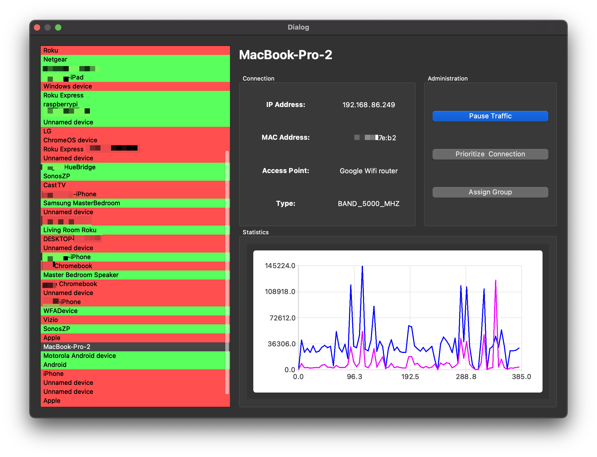

# Unofficial OnHub Desktop Client


This project was created due to the lack of options for interfacing with OnHub (now, Google Nest) Wi-Fi routers.   As of right now, this software's capabilities are limited. It can view network traffic quantities in real time, and that's about it. 

The app's code is somewhat hard to maintain and it is, therefore, being rewritten entirely. It was originally programmed when I was first learning C++ and in retrospect, I seem to have taken some very inefficient routes.

The retrieval of network data is based off of [my reverse-engineering](https://documenter.getpostman.com/view/7490211/SzzdD1pF?version=latest) of Google's private API.

 Reddit Community: [https://reddit.com/r/GoogleWiFiDesktop
](https://reddit.com/r/GoogleWiFiDesktop)




## Building

This project is programmed with Qt, a cross-platform C++ app framework. For building, use, as Qt 6 currently does not include necessary packages used by the app--such as `WebEngine` and `Charts`. 

Download Qt here: [https://www.qt.io/download-qt-installer](https://www.qt.io/download-qt-installer)

Once Qt 5.15.x has been installed for your operating system,

```
git clone https://github.com/AngeloD2022/OnHubDesktop.git

cd ~/Downloads/OnHubDesktopClient

qmake OnHubDesktopClient.pro

make
```

## Contributing

If you wish to help with development of this application (first, thank you) please use the `rewrite` branch for doing so.


